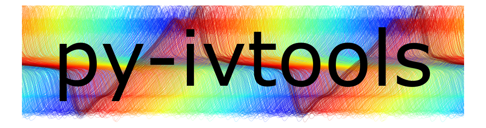

<h1>
<center>

</center>
</h1>

This is a package for measurement and analysis of current-voltage (I,&nbsp;V) characteristics.
I developed it during my PhD work, with contributions from several colleagues and students.  It runs on various setups at 
<a href="https://www.iwe.rwth-aachen.de/" target="_blank">IWE2</a>, [PGI-7](https://www.fz-juelich.de/en/pgi/divisions/electronic-materials-pgi-7), and other institutes.  It has been mainly used in a research setting for testing emerging memories such as ReRAM, PCM, OTS, CeRAM, and other obscure nanodevices.

The package includes a Python library [`ivtools`](ivtools/),
and a command-based interactive measurement environment, [`interactive.py`](interactive.py),
which are each described below.

## Installation

This package is designed to be edited by the user, so I recommend installing it in [development mode](https://setuptools.pypa.io/en/latest/userguide/development_mode.html) (with the -e flag).
This means `ivtools` will be loaded directly from the project folder and you can make changes without needing to reinstall.

The code is written for MS Windows, but much of it is cross-platform.

To install (e.g. using Anaconda Prompt)
:

1. Clone (or download) this repository
    ```cmd
    git clone https://github.com/thennen/py-ivtools.git
    ```
2. Navigate to the project directory
    ```cmd
    cd py-ivtools
    ```
3. Run
    ```
    python -m pip install -e .
    ```
4. If using for measurements, you'll likely need to install [NI-VISA](https://www.ni.com/en/support/downloads/drivers/download.ni-visa.html).

## Physical Setup 

The instrumentation code was originally written for a setup I built up from scratch to develop new measurement methods.
Essentially, it allows us to probe devices on semiconductor wafers/coupons by touching tiny contact pads with sharp needles under a microscope.


Together with external waveform generators, oscilloscopes, and source meter units, the setup uses custom mounts to hold PCBs we developed for different purposes
(e.g. [CLA](https://arxiv.org/abs/2102.05770) and [digipot](https://arxiv.org/abs/2112.00192))
which can be easily swapped in and out.  These PCBs have probe needles soldered directly to them, which minimizes parasitics that can ruin the measurements.
The setup is kept within range of a soldering iron, so if we need to make a modification, it takes minutes instead of hours and doesn't disrupt the testing process. The PCBs face upward and can be easily inspected by the same microscope that is normally focused on the wafer surface.

Instead of an expensive wafer positioning system, I used a piece of aluminum which slides on the table top for course positioning. Fine positioning is done with the x,y,z controls of the micropositioners.  This costs next to nothing and is surprisingly stable and flexible.  More importantly, it didn't take two years of effort to push through the university purchasing system.

The sample stage also has programmable
[temperature control](ivtools/instruments/firmware/EugenTempStage) using an analog PID controller and Peltier element, and has since been expanded by Johannes Mohr and Pascal Stasner with an auto-positioning system.

## ivtools library

This library is geared toward measurement and statistical analysis of large datasets. Specifically, we deal with large sequences of (I,V) traces and associated metadata. Collected metadata (e.g. date, temperature, sample information, instrument settings, post-processing steps, analysis results) follows the (I,V) data around even as it is sliced, filtered, transformed, etc.

Traces are constructed as dictionaries, containing keys 'I', 'V', and possibly others, with time-series values (1D numpy arrays of equal length). The dictionaries also store other metadata key,value pairs of other types (scalar, string, etc.).  Sequences of traces are simply concatenated lists of these dictionaries.

These primitive structures are each converted to Pandas objects (pd.Series for single traces, pd.DataFrame for multiple traces) for storage and high-level analysis. The conversion results in arrays nested in the dataframe cells, which is not really an intended use of Pandas, but is convenient nevertheless, and this was the best option among the many data structures that I surveyed.


An example I,V trace (pd.Series):
```
I                     [-2.4287506e-06, -2.4287506e-06, -5.6670924e-0...
V                     [-0.057499997, -0.073125005, -0.10125, -0.1168...
t                     [0.04100001367334789, 0.04100004567334857, 0.0...
RANGE                          {'A': 2.0, 'B': 2.0, 'C': 1.0, 'D': 2.0}
OFFSET                        {'A': 0.04, 'B': 0.0, 'C': 0.3, 'D': 0.0}
ATTENUATION                    {'A': 1.0, 'B': 1.0, 'C': 1.0, 'D': 1.0}
COUPLINGS                {'A': 'DC', 'B': 'AC', 'C': 'DC50', 'D': 'AC'}
sample_rate                                            156249997.671694
units                                              {'V': 'V', 'I': 'A'}
gain                                                               1930
nshots                                                           100000
wafer_number                                                    W264740
FF                                                                    2
row                                                                  10
col                                                                  23
width_nm                                                            100
polarity                                                         +outer
gitrev                                                          84ad71f
hostname                                                        pciwe46
username                                                         hennen
CC                                                               0.0003
T                                                                    20
filepath              D:\t\ivdata\2020-11-17_W264740_reram_complianc...
file_timestamp                                    2020-11-17_150250_530
downsampling                                                          5
smoothing                                                             5
Name: 0, dtype: object
```

The [`ivtools`](ivtools) library is structured as several .py files that contain related code (mostly functions):

[**ivtools\instruments\\***](ivtools/instruments) -- Classes and firmware for various PC-connected equipment in our labs.  Each instrument class contains code specific to a single instrument and does not contain application code.
These are mostly independent and can easily be separated from the package.

[**measure.py**](ivtools/measure.py) -- Functions that coordinate several different instruments to perform a measurement (e.g. triggering an AWG and capturing on a separate oscilloscope).

[**analyze.py**](ivtools/analyze.py) -- Metadata-preserving analysis functions for I,V data.  These are written to operate on a single dict input, and when decorated with `@ivfunc` the same function also works for lists of dicts, pd.Series and pd.DataFrames.
Array arguments can be broadcasted, and functions can also be passed as arguments to modify and extend capabilities.

[**plot.py**](ivtools/plot.py) -- Various plotting functions for I,V datasets.

[**io.py**](ivtools/io.py) -- Functions for reading, writing, and converting data in different formats.  Also contains the metadata management and database interface.

[**settings.py**](ivtools/settings.py) -- Programatically stores default settings, and user-specific settings.

[**scripts\\***](scripts) -- User scripts that may contain application specific code, and could potentially be useful to other users.

## interactive.py

This is a script that uses the ivtools library to provide a command-based user interface for interactive (I,&nbsp;V) measurements, for when you want a human in the feedback loop.
It is all Python-based and uses a modern console for complete flexibility,
as research needs are always changing.

A typical environment looks like this:


Here you see four customizable plots that visualize the incoming data as it is measured.  On the lower left we have a Jupyter qtconsole for command input. The space on the top right can be used for text editing and/or note taking.

Importantly, we have the ability to modify arbitrary parts of the codebase without disrupting the interactive measurement process.  This script is designed to be rerun, and all of the library code will be reloaded, with everything except the measurement settings and the program state overwritten.  You can modify almost any part of the code/library while making measurements without ever leaving the running program or closing/opening instrument connections.  The need to restart the kernel should therefore be rare.

The file should be run and rerun in ipython (Jupyter qtconsole) using
```
%run -i interactive.py [data folder name]
```

Short version of what the script does:
* Puts all the functions from every ivtools module into the global namespace.
* Creates a ISO8601 dated directory for storing data.
* Logs all console input and output to the data directory, and has other logging functionality.
* Notifies user of the git status and can optionally auto-commit changes.
* Automatically connects to instruments as specified in the [`settings.py`](ivtools/settings.py) file
* Uses a metadata management system (`meta`), which is a low-friction way to step through the metadata as probes are repositioned, ensuring that sample data is always attached to measurement data.  It also writes to a local (sqlite) database.
* Opens a set of customizable figures (`iplots`) that are tiled across the screen and know how to plot data and can be controlled (cleared, etc). from the console.
* Provides interactive versions of measurement functions defined in [`measure.py`](ivtools/measure.py) that automatically plot and save data.
* Defines short bindings to certain function calls for interactive convenience (called without ()).
