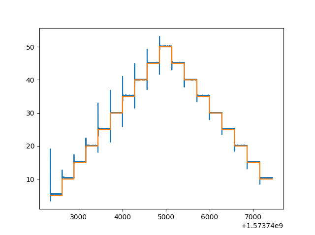

# PID-Controller based on Arduino + Python to control Peltier-Temperature
### Hardware Setup:
  - Arduino Micro
  - 2 Power Supplies for both polarities
  - Opamps (see at Cicruit-File)
  - Trimmers to tune Controller
  - Resistors/Capacitors
  - Digital/Analog Converter (DAC) Adafruit MCP4725
  - LCD-Display/LED-Backpack Adafruit
  - Peltier-Element (110W)
  - PT1000


### Installation

First of all the official Arduino-IDE to program the "Micro" is required. A Python-IDE is free to choose.

Those Arduino-Libaries are necessary:

```sh
Wire.h
Adafruit_GFX.h
math.h
CmdMessenger.h
Adafruit_MCP4725.h
Liquid_Crystal.h
Filter.h
```

Python modules required:
```sh
import serial
import numpy as np
```


### Description

The Idea of this project is to change and control the temperature of the Peltier-Element fast and pretty acurate via PC.

In this project I'm using a Wheatstone-Bridge to measure the resistance value of a RTD which is proportional to the temperature.
The voltage between the bridge will be read from Arduino on PIN A1. To send the serial information to the Controller I'm using a DAC (good noise reduction instead of using PWM).
To control Arduino via Python the serial module is required. The Python-Part will explain the hole procedure.

### Arduino-Part
To calculate the resistance-value of the Bridge this function is in use:

```sh
float pt_resistor(float volt_now, float volt_bridge)
{
  //Resistor-Values
  float r_1, r_3, r_4;
  r_1 = 9975;
  r_3 = 9976;
  r_4 = 1001;
  
  //Equation for PT-Resistor-Value:
  float pt_zaehler = ( (volt_now * r_4) + ( (r_3 + r_4) * volt_bridge ) ) * r_1;  // R1 * ( V_g*(R4+R3)+R4*V_s)
  float pt_nenner = ((r_3 + r_4) * volt_now ) - ( volt_bridge * (r_3 + r_4) + volt_now * r_4);  // V_s*(R3+R4) - ( V_b*(R3+R4) + V_s*R4)

  //Convert Voltage in Temperatur by PT1000 Equation:

  float pt_res = (pt_zaehler / pt_nenner);
  return pt_res;
  
}

```

With this Value you can calculate the right temperature by using this statement:
```sh
  // Temperature Equation
  float temperature = (log(pt_resistor(volt_now, voltbridge) / 1000) / log(1.00385));
  float temp_log = temperature; 

```


The Arduino Code has a enum-list to recognize the serial commands:
```sh
-A0 -> Command to set analog out "0;"
-A1 -> Command to read analog input "1;"
-Reply -> Command to report status "2;"
```

SerialMonitor example: "0,4,155;" { "Command(0-2), Digital-Pin, Value(0-255);" }


Arduino needs a Callback function to attach the serial commands properly. With this function sending and getting serial commands is possible.
```sh
void attachCommandCallbacks()
{
  // Attach callback methods
  cmdMessenger.attach(OnUnknownCommand);
  cmdMessenger.attach(AO, AnalogOutput);
  cmdMessenger.attach(AI, AnalogInput);
}
```

Arduino will listen to the Callback commands with this statement in the loop()-Function:
```sh
cmdMessenger.feedinSerialData();
```

### Python-Part

The Python Class has two functions which are reading and sending serial commands from and to the Arduino:
```sh
def analogOut(self, voltage):
    ...

def analogIn(self, channel):
    ...
```
To read the PT-Element's temperature this function is in use:
```sh
def read_temperature(self):
    ...
```

To set a specific temperature this function is in use:
```sh
def set_temperature(self, temp):
    ...
```
Temperature-Unit is "Celsius"!


### Circuit-Part
See the circuit in the "Circuit"-Directory. 3 Major-Parts:
```sh
1.Wheatstone-Bridge + InstrAmpl + DiffAmpl
2.PID-Setup
3. Push-Pull Ampl + PT-Element
```

### Result

Result is good so far but the PID-Controller needs to be tuned better (P is too high). 

